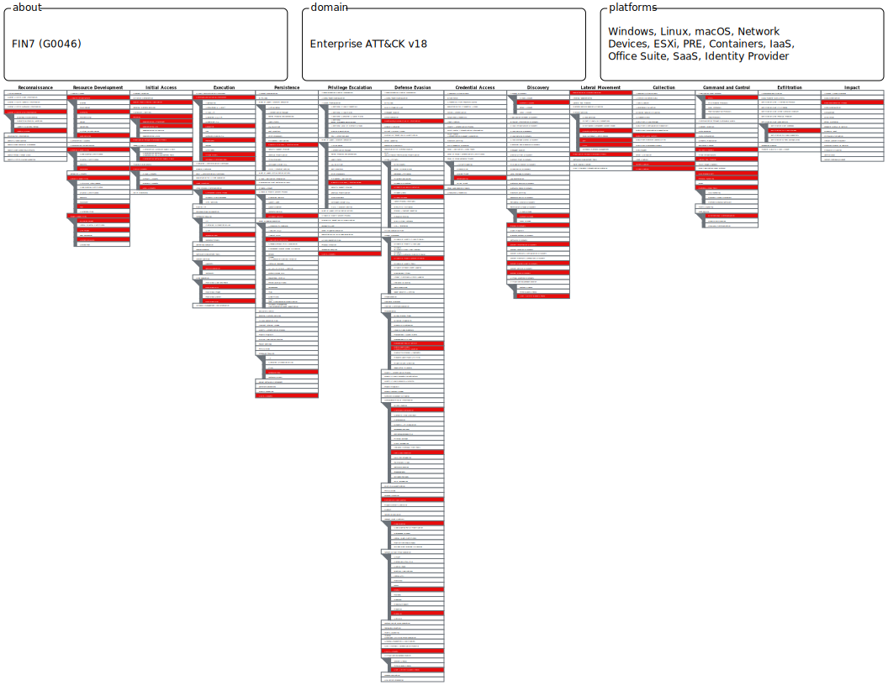

# FIN7 — Techniques Analysis

## Overview
FIN7 (G0046) is a financially-motivated threat group active 
since 2013. Targets retail, restaurant, hospitality, and 
financial sectors. Known for using Darkside ransomware and 
big game hunting operations.

## Key Techniques Used (from MITRE ATT&CK)

| ID | Technique | Category |
|---|---|---|
| T1566 | Phishing: Spearphishing Attachment & Link | Initial Access |
| T1078 | Valid Accounts: Local Accounts | Initial Access |
| T1059 | Command and Scripting Interpreter (PowerShell, JS, VBS) | Execution |
| T1546.011 | Event Triggered Execution: Application Shimming | Persistence |
| T1562.004 | Impair Defenses: Disable or Modify System Firewall | Defense Evasion |
| T1564 | Hide Artifacts: Hidden Files and Directories | Defense Evasion |
| T1210 | Exploitation of Remote Services (ZeroLogon) | Lateral Movement |
| T1567.002 | Exfiltration Over Web Service: Cloud Storage (MEGA) | Exfiltration |
| T1486 | Data Encrypted for Impact (Darkside Ransomware) | Impact |

## ATT&CK Navigator Map

