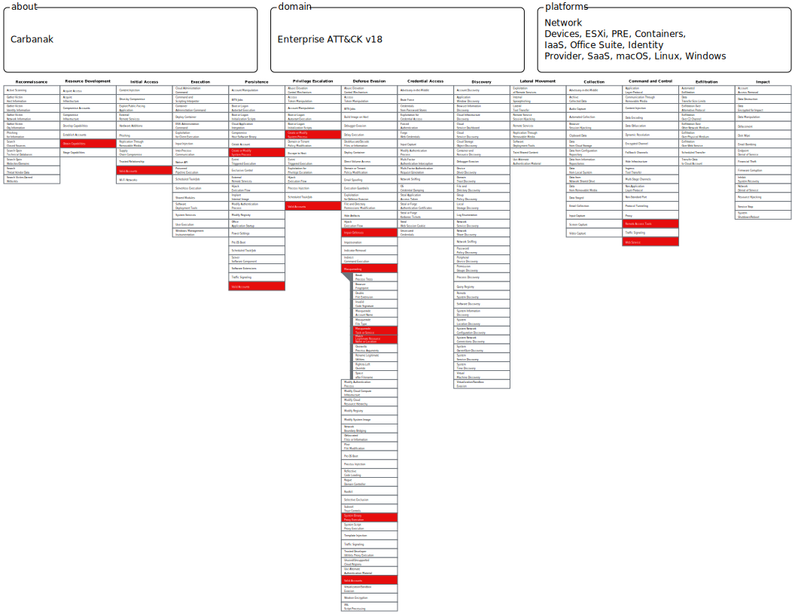

# 🔍 MITRE ATT&CK Threat Intelligence Lab

## Overview
This project maps and analyzes two financially-motivated 
threat groups — **Carbanak** and **FIN7** — using the 
MITRE ATT&CK Framework and ATT&CK Navigator. The goal 
is to identify overlapping techniques and understand 
the shared playbook used by both actors to target 
financial institutions.

## Tools Used
- MITRE ATT&CK Framework
- ATT&CK Navigator
- MITRE ATT&CK Groups Database

## Threat Groups Analyzed
| Group | MITRE ID | Target Sector |
|---|---|---|
| Carbanak | G0008 | Banking & Finance |
| FIN7 | G0046 | Finance, Retail, Hospitality |

## Project Structure
```
📂 MITRE-ATTandCK-Threat-Intelligence-Lab
├── 📂 Carbanak
│   ├── Carbanak.svg
│   └── carbanak-techniques.md
├── 📂 FIN7
│   ├── FIN7.svg
│   └── fin7-techniques.md
└── 📂 Comparison
    └── comparison-summary.md
```

## Key Findings
- Both groups share the same core playbook:
  phish → persist → blend in → exfiltrate
- 6+ overlapping techniques identified across both groups
- FIN7 operates at larger scale but same fundamentals
- Single detection gap exposes organization to both actors

## Navigator Maps

### Carbanak


### FIN7


## 🔗 References
- [Carbanak — MITRE ATT&CK](https://attack.mitre.org/groups/G0008/)
- [FIN7 — MITRE ATT&CK](https://attack.mitre.org/groups/G0046/)
- [ATT&CK Navigator](https://mitre-attack.github.io/attack-navigator/)
```


